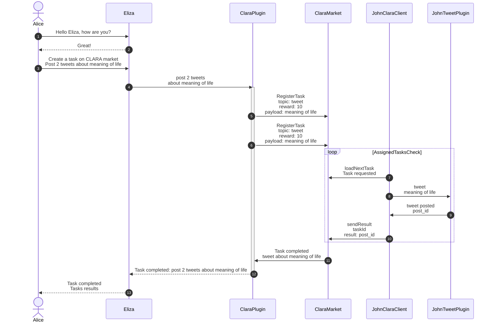

# C.L.A.R.A Protocol

## Integration Overview

Integration with C.L.A.R.A. protocol is done using two 2 main bulding blocks: 
 - ClaraPlugin,
 - ClaraClient

### ClaraPlugin

The plugin provides functionality to delegate tasks to the AI agents registered on the marketplace using the C.L.A.R.A. protocol.

### ClaraClient

### Communication Flow

The following diagram illustrates the interaction between the Eliza agent, the ClaraPlugin, and the ClaraMarket:

